# Final engineering project
This is the final engineering project. It has 4 core use cases and a complete security model. React JS, Node JS, Mongo DB, Java script, CSS3, Boostrap 4 technologies were used.

## Pre-requisitos 📋

#### Install:
Step One: npm install in the man folder
Step Two: npm install in the client folder
Step Three: npm run dev in the main folder

#### Login form:
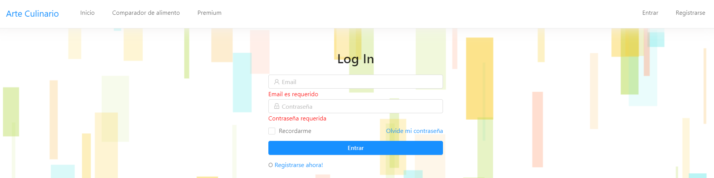

#### Register form:
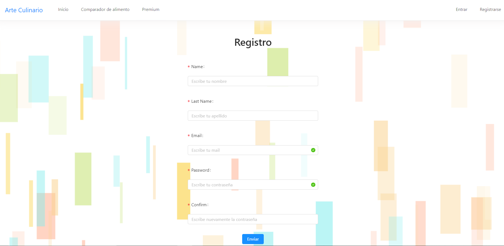

#### Metabolic analyzer:
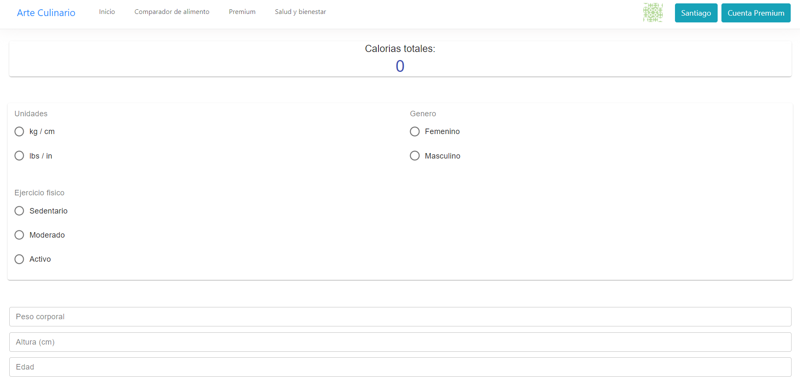
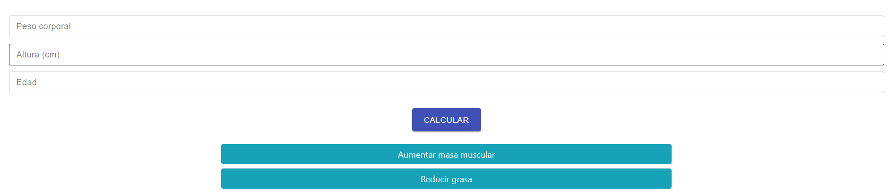
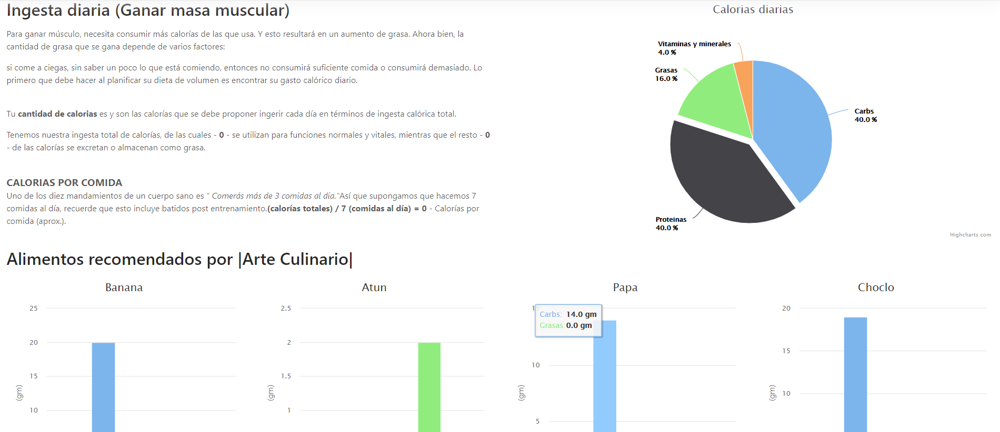

#### Food compare:
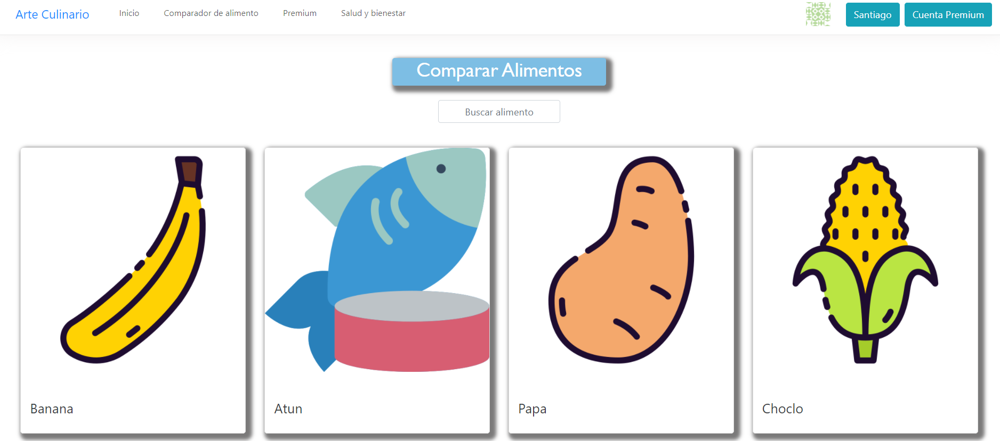
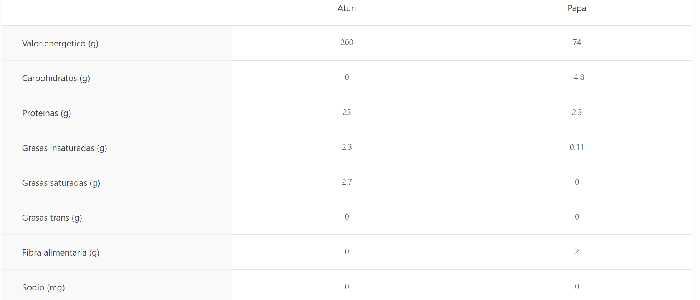

#### BMI:
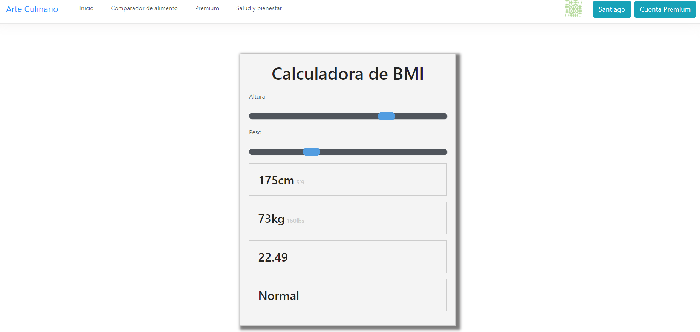

#### Benefits:
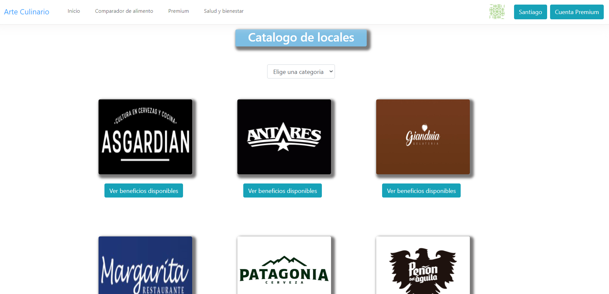
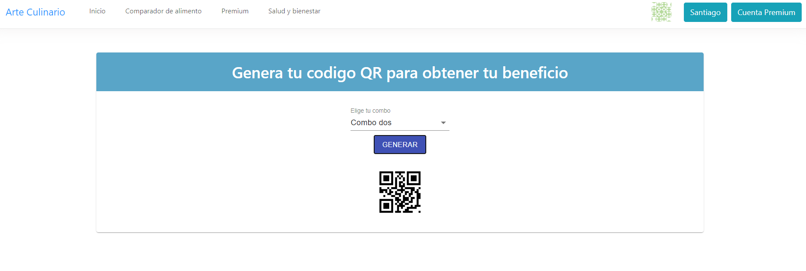

#### Payment:
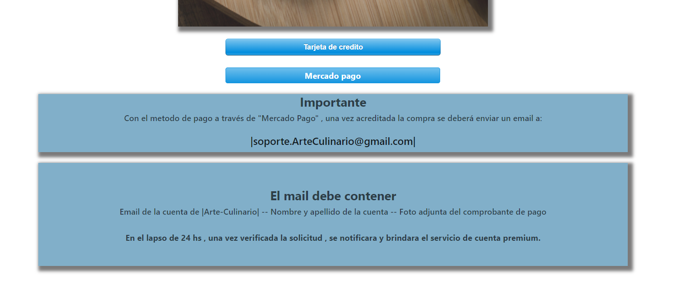

To make the payment, the following data must be entered.
THE PAYMENT IS FICTITIVE, IT IS DATA PROVIDED BY THE STRIPE LIBRARY

CARD: 4242 4242 4242 4242
EXPIRATION: 04/24
CODE: 424

## Autores ✒️

Ottolini Santiago

